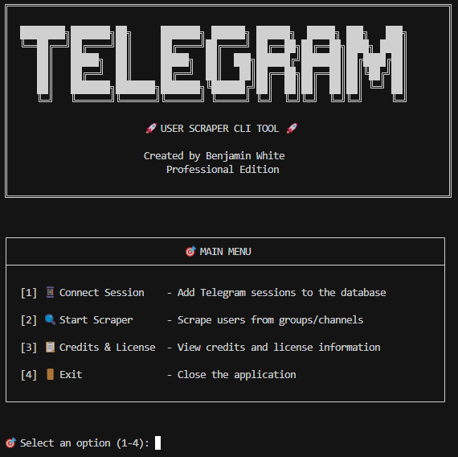
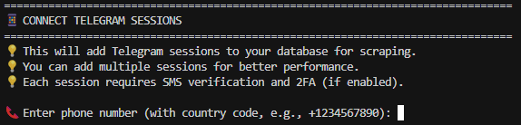
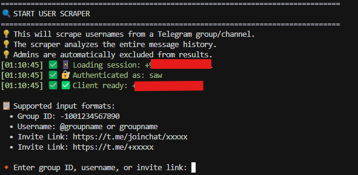

# 🚀 Telegram Username Extractor - Professional Scraping Tool

A powerful, professional-grade Telegram username extraction tool with an intuitive CLI interface. Extract active usernames from any Telegram group or channel by analyzing complete message history with advanced filtering capabilities.

[](https://github.com/BenjaminWhiteUK/telegram-user-scraper)
[](https://www.python.org/)
[](https://github.com/BenjaminWhiteUK/telegram-user-scraper)
[](https://github.com/BenjaminWhiteUK)
[](https://core.telegram.org/api)
[](https://github.com/BenjaminWhiteUK/telegram-user-scraper/stargazers)
[](https://github.com/BenjaminWhiteUK/telegram-user-scraper/network/members)

## 📸 Screenshots

### 🎯 Main Menu Interface

*Professional CLI interface with intuitive menu options*

### 🔗 Session Connection Process  

*Easy session setup with step-by-step guidance*

### 🚀 Scraper in Action

*Real-time progress tracking and professional output*

## ✨ Features

- **🎯 Smart User Detection**: Analyzes entire message history to find users who have actually chatted
- **👑 Admin Filtering**: Automatically excludes all administrators and moderators
- **📱 Multi-Session Support**: Add multiple Telegram sessions for better performance
- **🛡️ Memory Optimized**: Designed for low-resource servers (3GB+ RAM recommended)
- **🎨 Professional CLI**: Beautiful, user-friendly command-line interface
- **🔒 Secure**: Safe session management with proper error handling

## 🛠️ What This Tool Does

The **Telegram Username Extractor** is a comprehensive solution for **Telegram scraping**, **username extraction**, and **user analysis**. This **Telegram bot** alternative analyzes Telegram groups and channels to extract usernames of active users. Unlike basic member lists, this advanced **Telegram scraper** tool:

1. **📊 Complete Message History Analysis**: Scans every message ever sent in the group/channel
2. **🎯 Active User Identification**: Only collects usernames from users who have actually participated in conversations  
3. **🤖 Smart Filtering System**: Automatically excludes admins, bots, and deleted accounts
4. **💾 Clean Data Export**: Outputs organized username lists to text files for easy use
5. **🔒 Privacy Compliant**: Respects Telegram's ToS and user privacy guidelines

**Perfect for**: Marketing research, community analysis, user engagement studies, and legitimate business intelligence.

## 📁 Repository Structure

```
telegram-user-scraper/
├── 📄 scraper.py          # Main application script
├── 📖 README.md           # This documentation
├── 📸 photo/              # Screenshots and examples
│   ├── main_menu.png      # Main menu interface
│   ├── scraper.png        # Scraper in action
│   └── session_connection.png  # Session setup process
└── 🚫 .gitignore          # Git ignore rules
```

## 📋 Requirements

### System Requirements
- **Operating System**: Linux, Windows, or macOS
- **RAM**: 3GB+ recommended (2GB minimum)
- **Python**: Version 3.7 or higher
- **Internet**: Stable connection for Telegram API

### Required Libraries
```bash
pip install telethon psutil uvloop
```

**Optional but Recommended:**
```bash
pip install tgcrypto  # For faster encryption (reduces CPU usage)
```

## 🚀 Installation

### Method 1: Quick Setup
```bash
# Download the script directly
wget https://raw.githubusercontent.com/BenjaminWhiteUK/telegram-user-scraper/main/scraper.py

# Install dependencies
pip3 install telethon psutil uvloop tgcrypto

# Make executable
chmod +x scraper.py

# Run the tool
python3 scraper.py
```

### Method 2: Full Installation
```bash
# Clone the repository
git clone https://github.com/BenjaminWhiteUK/telegram-user-scraper.git
cd telegram-user-scraper

# Install dependencies
pip3 install telethon psutil uvloop tgcrypto

# Run the application
python3 scraper.py
```

## 📖 How to Use

### Step 1: Launch the Application
```bash
python3 scraper.py
```

You'll see the professional main menu interface:


### Step 2: Connect Your Telegram Session
1. Select **[1] 📱 Connect Session** from the main menu
2. Enter your phone number with country code (e.g., +1234567890)
3. Enter the SMS verification code sent to your phone
4. If you have 2FA enabled, enter your password
5. Choose whether to add more sessions or return to main menu

The session connection process is guided and user-friendly:


### Step 3: Start Scraping
1. Select **[2] 🔍 Start Scraper** from the main menu
2. Enter the target group information:
   - **Group ID**: `-1001234567890`
   - **Username**: `@groupname` or `groupname`
   - **Invite Link**: `https://t.me/joinchat/xxxxx` or `https://t.me/+xxxxx`
3. Wait for the scraping process to complete
4. Find results in `users.txt`

Watch the scraper work with real-time progress updates:


## 💡 Usage Examples

### Example 1: Scraping by Username
```
🔸 Enter group ID, username, or invite link: @cryptotraders
🚀 Starting user scraping...
🔍 Starting to scrape users from: Crypto Traders
📊 Group: Crypto Traders
🕐 Scanning entire message history for active users...
📈 Processed 5000 messages, found 127 unique usernames
🎯 History scan completed!
📊 Total messages processed: 8420
✅ Unique usernames found: 234
🎉 Successfully scraped 234 usernames!
📁 Results saved to: users.txt
```

### Example 2: Scraping by Group ID
```
🔸 Enter group ID, username, or invite link: -1001234567890
🚀 Starting user scraping...
📊 Total messages processed: 12,340
✅ Unique usernames found: 456
```

### Example 3: Scraping by Invite Link
```
🔸 Enter group ID, username, or invite link: https://t.me/joinchat/AAAAAEhyO1234567890
🔗 Joining group via invite link...
✅ Successfully joined group
🚀 Starting user scraping...
```

## 📁 Output Format

Results are saved to `users.txt` with one username per line:
```
username1
username2
username3
crypto_trader_99
telegram_user_2024
```

## ⚙️ Configuration

### API Credentials
The tool uses pre-configured API credentials. **For production use, you should use your own API credentials:**

1. **Get your own API credentials** from [https://my.telegram.org/auth?to=apps](https://my.telegram.org/auth?to=apps)
2. **Replace `API_ID` and `API_HASH`** in the script with your own credentials
3. **Restart the application**

**Why use your own API credentials?**
- Better rate limits and performance
- Avoid potential restrictions on shared credentials
- More secure and reliable for production use

### Memory Settings
For servers with different RAM amounts, you can adjust these settings in the script:
- **2GB RAM**: Reduce batch sizes and increase delays
- **4GB+ RAM**: Default settings work well
- **8GB+ RAM**: Increase batch sizes for faster processing

## 🛡️ Safety & Best Practices

### Telegram Terms of Service
- ✅ Use responsibly and respect Telegram's ToS
- ✅ Don't use for spam or harassment
- ✅ Respect user privacy and data protection laws
- ✅ Avoid excessive API calls

### Rate Limiting
The tool includes built-in rate limiting:
- Smart delays between requests
- Automatic flood wait handling
- Memory management to prevent crashes

### Security
- Sessions are stored locally in encrypted format
- No sensitive data is transmitted to external servers
- Clean session management with proper disconnection

## 🔧 Troubleshooting

### Common Issues

**"No active sessions found"**
```bash
# Solution: Add a session first
# Select [1] Connect Session from main menu
```

**"Memory errors on low-RAM servers"**
```bash
# Solution: Close other applications or upgrade RAM
# The tool is optimized for 3GB+ servers
```

**"Flood wait errors"**
```bash
# Solution: The tool handles this automatically
# Just wait for the specified time
```

**"Can't join private group"**
```bash
# Solution: Make sure you have permission to join
# Or use a group where you're already a member
```

### Getting Help
1. Check the error messages - they're designed to be helpful
2. Ensure you have stable internet connection
3. Verify your Telegram account isn't restricted
4. Try with a different group to test functionality

## 📊 Performance

### Typical Performance
- **Small Groups** (< 1,000 members): 1-2 minutes
- **Medium Groups** (1,000-10,000 members): 5-15 minutes  
- **Large Groups** (10,000+ members): 15-60 minutes

### Factors Affecting Speed
- Group size and message history
- Server internet speed
- Telegram API rate limits
- Number of active sessions

## 🔄 Updates & Maintenance

### Keeping Updated
```bash
# Check for updates
git pull origin main

# Update dependencies
pip3 install --upgrade telethon psutil uvloop
```

### Database Maintenance
The tool uses SQLite for session storage. The database file `sessions.db` is created automatically and requires no maintenance.

## 📜 License & Credits

### Created By
**Benjamin White** - Professional Edition

### License
This software is provided "as is" for educational and research purposes. See the Credits & License section in the application for full terms.

### Acknowledgments
- [Telethon](https://github.com/LonamiWebs/Telethon) - Powerful Telegram client library
- Python community for excellent libraries and tools
- Open source contributors worldwide
- Telegram for providing robust API access

### 🏷️ Keywords & Tags
`telegram scraper` `username extractor` `telegram bot` `telegram api` `python telegram` `telegram automation` `user analysis` `telegram tools` `message history` `telegram mining` `social media scraping` `telegram usernames` `cli tool` `benjamin white` `professional scraper`

### 🔗 Repository Links
- **📦 Main Repository**: https://github.com/BenjaminWhiteUK/telegram-user-scraper
- **📥 Direct Download**: https://raw.githubusercontent.com/BenjaminWhiteUK/telegram-user-scraper/main/scraper.py
- **🐛 Issues & Bug Reports**: https://github.com/BenjaminWhiteUK/telegram-user-scraper/issues
- **⭐ Star the Project**: https://github.com/BenjaminWhiteUK/telegram-user-scraper/stargazers

## 🌟 Support

### Before Reporting Issues
1. Read this README completely
2. Check the troubleshooting section
3. Ensure you're using the latest version
4. Test with a simple, public group first

### Feature Requests
This tool is actively maintained. Feature requests and improvements are welcome through proper channels.

---

## 🎯 Quick Start Summary

1. **Install**: `pip3 install telethon psutil uvloop`
2. **Download**: `wget https://raw.githubusercontent.com/BenjaminWhiteUK/telegram-user-scraper/main/scraper.py`
3. **Run**: `python3 scraper.py`
4. **Connect**: Add your Telegram session  
5. **Scrape**: Enter group info and start scraping
6. **Results**: Check `users.txt` for extracted usernames

**🚀 Ready to extract usernames like a pro**

---

## ⭐ Show Your Support

If this tool has been helpful to you, please consider showing your appreciation:

### 🌟 **Give us a Star on GitHub!**

Your star helps us grow and motivates us to keep improving this tool. It takes just one click and means the world to us!

**👆 [Click the ⭐ Star button at the top of this page](https://github.com/BenjaminWhiteUK/telegram-user-scraper)**

### 💝 Why Your Star Matters:
- 🚀 **Boosts visibility** - Helps other developers discover this tool
- 💪 **Shows appreciation** - Motivates continued development and improvements  
- 🌍 **Builds community** - Creates a network of users and contributors
- 📈 **Drives innovation** - More stars = more features and updates

### 🎯 **It's Free, Fast & Makes a Difference!**

**⭐ Star this repo → Share with friends → Help the community grow!**

---

*Made with ❤️ by Benjamin White | Professional Edition v1.0*

**🌟 Don't forget to star the repo if you found it useful! 🌟**
